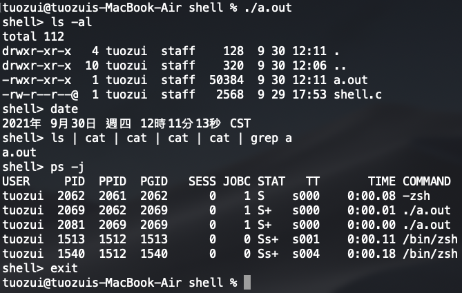
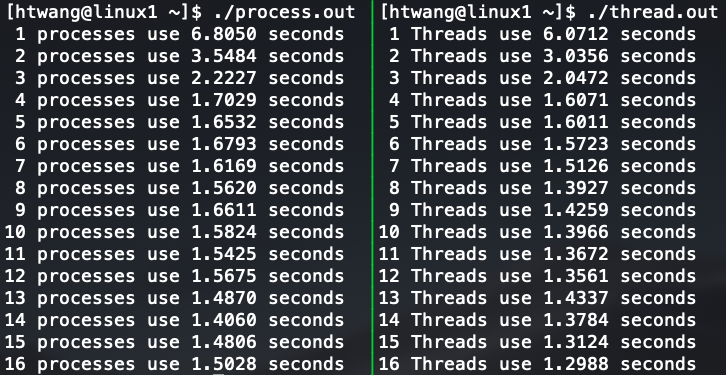

OS跟網路程式筆記
---

- [shell in c](shell)

  
- [chatroom using socket and multi-thread](chatroom)

  
- [matrix production with multithreading and multiprocessing](matrix_production_with_multithreading_and_multiprocessing)

  

